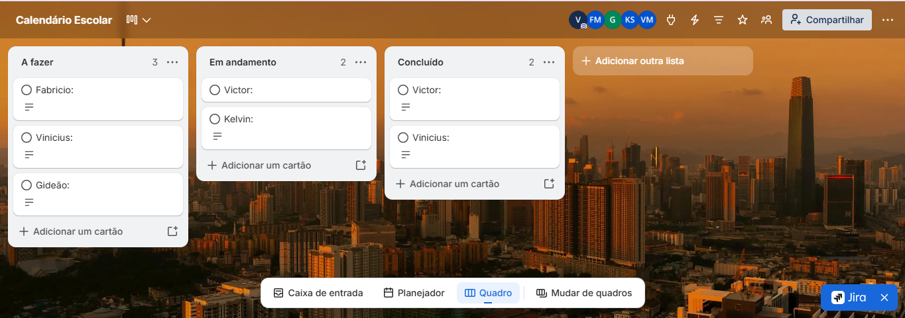
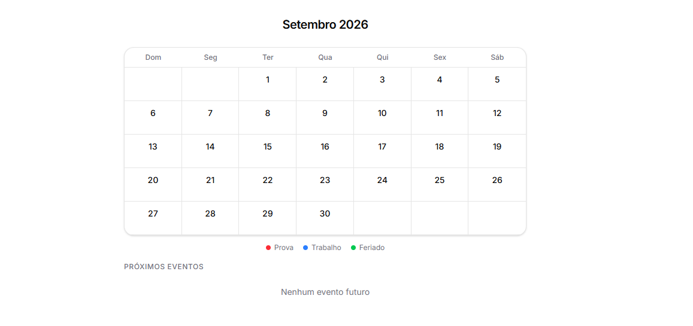
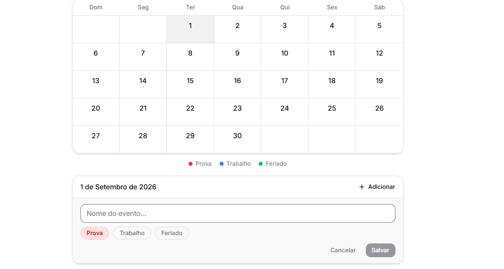
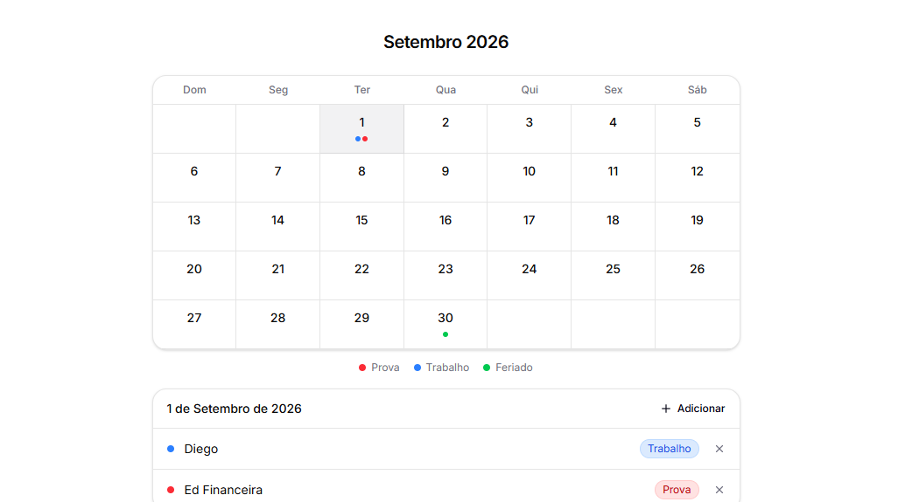

# [Calendario Escolar]
> **Status:** Planejamento inicial
> **Data:** 18/05/2026
## Problema
Alunos do ensino médio tem dificuldades em organizar seus estudos e acabam esquecendo de fazer ou estudar para provas, trabalhos e etc.
## Solução
[Criar um aplicativo de Calendario que lembre os alunos de suas obrigações escolares]
## Público-alvo
Alunos do ensino médio
## Funcionalidades principais (máx. 5)
1.Organizar os estudos
2.Ajudar alunos com tarefas e provas
## Diferencial competitivo
Criar algo inovador para ajudar alunos
## Tecnologias planejadas (Back-end)
[Serão definidas nas aulas de Programação Back-end]
## Riscos iniciais
1. Complicação na aplicação dos papéis do time
2. Adaptação do usuario ao sistema
3. Erros do aplicativo
## Cronograma básico (semanas)
- Semana 1: documentação, wireframes, Kanban
- Semana 2: protótipo Figma
- Semana 3: validação
- Semana 4: MVP
- Semana 5: backlog
- Semana 6: indicadores
- Semana 7: métricas
- Semana 8: prova teórica
- Semana 9: roteiro pitch
- Semana 10: screenshots
- Semana 11: pitch final
## Integrantes e papéis
|Fabricio|(Back-end)|
|Vinicius|(Documentação)
|victor da Silva|(product magner)|
|Gideão|(scrum master)|
|Kelvin|(Front-end)

| Prioridade | História de usuário | Critérios de aceite |
|------------|---------------------|----------------------|
| must | Como aluno, quero ver o calendario escolar | Calendario |
| must | Como aluno, quero marcar quando tera provas  | Opçaõ de marcar e notificar o usuario |
| should | Como aluno, marcar o horario das provas | Avisar quando esta chegando no horario |
| could | Como aluno, escolher qual materia será a prova | Lista de materias para selecionar |

## Kanban e indicadores

| Indicador | Valor |
| - - - - - - - - - - -| - - - - - - -|
| WIP ( limite ) | 2 c a r t e s |
| Lead Time m d i o | 1 ,0 dias |
| Cycle Time m d i o | 16, 0 dias |

## Screenshots da a p l i c a o
* Tela inicial do MVP *

* Tela onde marca as datas *

* Tela Final *

## M t r i c a s de v a l i d a o
-  F o r m u l r i o : [https://docs.google.com/forms/d/e/1FAIpQLSfuaCTnSF3xLlHYwMnMN8gDwk5qFy3tL6UvHvJpuLxKrh9Wlw/viewform?usp=sharing&ouid=108574350887974437528]
-  Total de respostas : 3
-  Taxa de interesse : 100% disseram que usariam
-  NPS m d i o : 7 ,3
-  **Principais feedbacks :**
- "Tinha que ter como adicionar conteudos ou oq estudar sobre as provas marcadas"
-  "Ponharia uma IA para me ajudar nos conteudos escolares"  

## Links úteis
- **Kanban (Trello):** [https://trello.com/invite/b/6a1d94cf6e15288b6961bee6/ATTI1a58a38fb4522dd5462c9ce40c4b5260D5D5D4B5/calendario-escolar]
- **Protótipo (Figma)**:https://www.figma.com/make/BhBjUjdE9l0D921kjjZ4Yl/Basic-Calculator-Program?t=4sPh1dcjjnmYk0W4-1
- **Repositório:** [https://github.com/Vlnlxz/Programa-o.git]
- **MVP:** https://www.figma.com/make/UGXRFokYm3HY0kCQFvcaFZ/Calend%C3%A1rio-de-Eventos-Simplificado?t=GA2NDXzUG3XQsCUX-1
